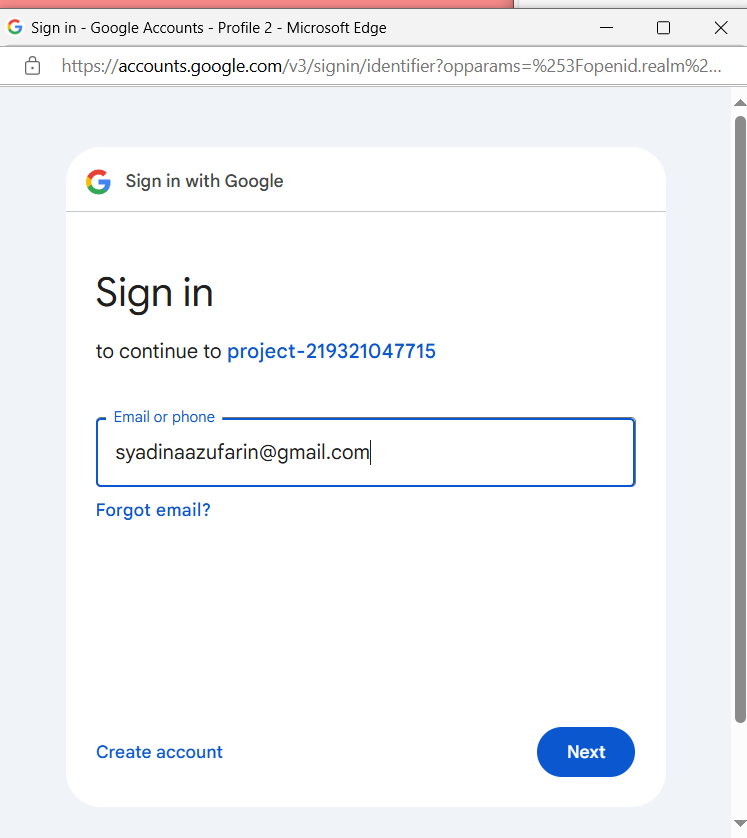
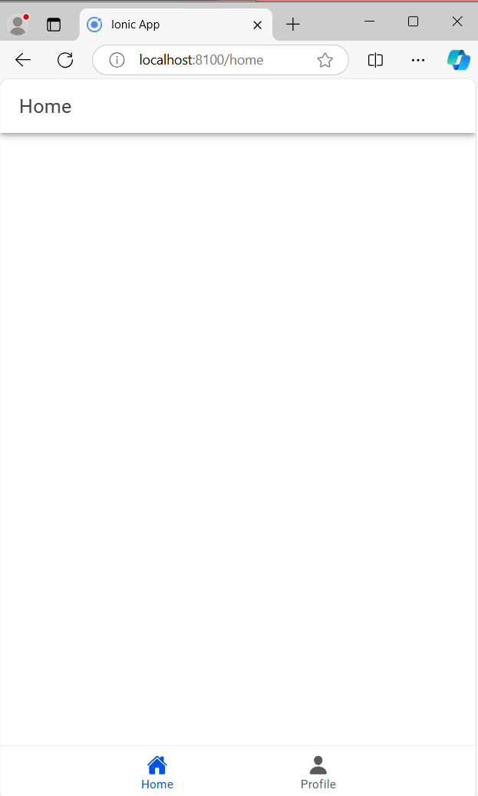
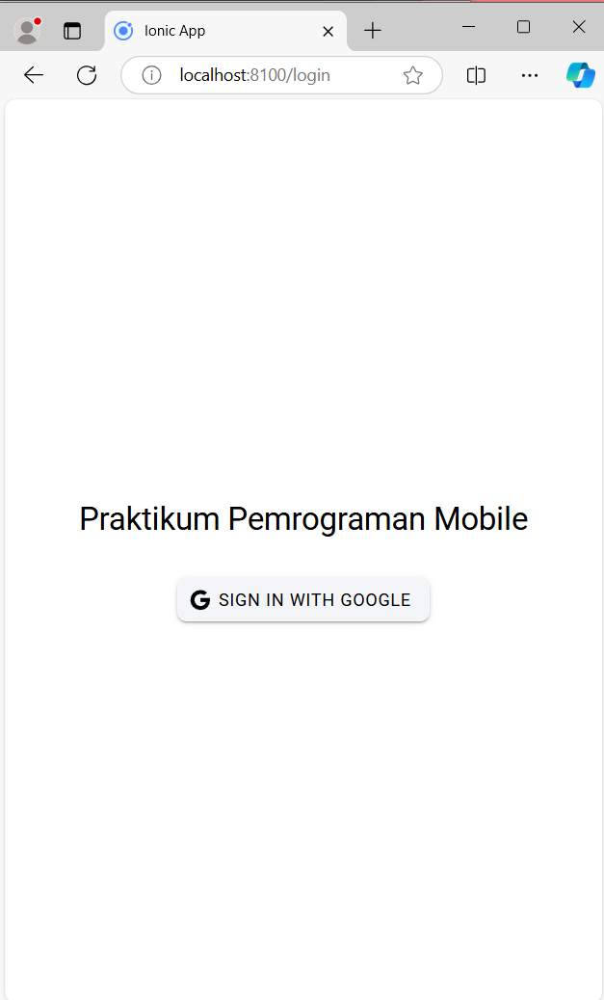

# SYADINAZUFARIN_H1D021077_IonicVueFirebase

LINK SOURCE CODE LENGKAP : https://drive.google.com/file/d/1L6jNt-QhDkXbqoWMY8pHEh4Vk5cdcx_c/view?usp=sharing

### 1. Tahapan Sign In 

  Halaman ini sebagai halaman awal yang akan membawa kita pada tahapan autentikasi login. Halaman ini menampilkan button untuk melakukan sign in dengan google. 
  


  Selanjutnya. setelah menekan button sign in tersebut maka, kita akan diarahkan pada tahap selanjutnya yaitu memasukkan email dan password yang akan kita gunakan untuk melakukan login pada project ini. 
Dalam hal ini, saya menggunakan email syadinaazufarin@gmail.com.

  


Setelah memasukkan email dan password yang sesuai maka akan muncul halaman persetujuan untuk meyakinkan kita melanjutkan login kedalam project ini.


### 2. Halaman Home

  Halaman home adalah salah satu halaman yang ditampilkan sebagai halaman utama setelah kita melakukan proses login. 



### 3. Halaman Profile

  Halaman profile sebagai halaman lain yang juga ditampilkan sebagai halaman utama. Dalam halaman profile ini ditampilkan nama dan juga email yang sesuai dengan email yang kita masukkan sebelumnya. 
Selain itu, terdapat juga foto profile yang ditampilkan pada halaman ini. 
Foto profil yang saya tampilkan pada halaman ini ialah gambar mekkah. 


### Foto Profil 


### Tahapan menambahkan foto profil 

### **1. Memilih Foto Default**
Gambar default ini digunakan ketika saya belum memiliki foto profil atau jika terjadi masalah saat memuat foto. 
        
- File gambar diletakkan di folder `src/assets/` dengan nama `mekkah.png`.  
- Path gambar ini disimpan dalam variabel `defaultPhoto` di dalam script.

```ts
const defaultPhoto = '/assets/mekkah.png';
```

---

### **2. Membaca Foto Profil dari Firebase**
Dengan memanfaatkan properti `photoURL` dari data pengguna (`user`) yang diperoleh dari Firebase Authentication.  

- Jika `photoURL` ada, maka URL akan digunakan.  
- Jika tidak ada, maka akan menggunakan gambar default dari folder `assets` dalam hal ini yaitu file 'mekkah.png'.

```ts
const userPhoto = ref(user.value?.photoURL || defaultPhoto);
```

---

### **3. Menggunakan `watch` untuk Perubahan Data**
Watch digunakan ketika terjadi perubahan data.

-  Ketika saya memiliki `photoURL`.
- Jika tidak ada, maka akan menggunakan gambar default. 
```ts
watch(
    () => user.value,
    (newUser) => {
        userPhoto.value = newUser?.photoURL || defaultPhoto;
    },
    { immediate: true }
);
```

---

### **4. Menangani Error Saat Gambar Tidak Bisa Ditampilkan**
Jika gambar profil pengguna tidak dapat dimuat (misalnya, URL tidak valid), maka digunakan event `@error` pada elemen ``. Ketika terjadi error, gambar default akan digunakan sebagai gantinya.

```html

```

Dan berikut adalah fungsi untuk menangani error tersebut:

```ts
function handleImageError() {
    userPhoto.value = defaultPhoto;
}
```

---

### **5. Penggunaan CSS**

```css
ion-avatar img {
    width: 100px;
    height: 100px;
    border-radius: 50%;
    object-fit: cover;
}
```

---

### **6. Integrasi Gambar dari Folder `assets`**
Karena saya menggunakan gambar dari folder `src/assets`, maka path gambar disesuaikan dengan struktur Ionic. yaitu :
- Gambar disimpan di `src/assets/mekkah.png`.

---


### 4. Logout 
Logout dilakukan dengan menekan button 'logout' yang terletak di sebelah pojok kanan atas. Ketika kita menekan button tersebut, maka akan diarahkan ke halaman awal lagi yakni halaman Sign in.


